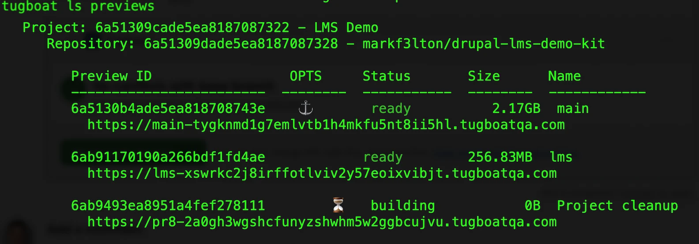

# Tugboat Previews

[Tugboat](https://www.tugboatqa.com) builds a live, shareable preview site for every pull request. You can hand a URL to someone non-technical and they can click around a full Drupal LMS demo without installing anything.

This page covers only what's specific to this kit. For everything else refer to Tugboat's own docs:

- [Tugboat documentation](https://docs.tugboatqa.com/)
- [Connecting a GitHub repo](https://docs.tugboatqa.com/setting-up-tugboat/select-a-git-provider/)
- [config.yml reference](https://docs.tugboatqa.com/setting-up-services/)
- [Drupal starter configs](https://docs.tugboatqa.com/starter-configs/)

## Setup

1. Create a [Tugboat](https://www.tugboatqa.com) account and a project.
2. Connect it to your GitHub repo (Tugboat installs a GitHub app; grant it access to this repo). Tugboat reads `.tugboat/config.yml` from the repo — no dashboard configuration needed.
3. Set the branch you demo from (e.g. `main`) as a **Base Preview** so PR previews clone from it and build fast.

## How this config works

`.tugboat/config.yml` provisions previews in two phases: **`init`** runs once when a preview's containers are first created, while **`build`** runs on every build or refresh and brings code and config up to date. PR previews build on every push; branch previews (built from the **Branches** tab) only update when you refresh them.

- **Database settings via symlink.** Drupal needs Tugboat's database credentials. `init` symlinks `.tugboat/settings.tugboat.php` to `web/sites/default/settings.local.php`, which the stock `settings.php` includes if present. Hosting concerns stay in the hosting config.
- **Seeded database when available.** `init` imports `.tugboat/database.sql.gz` if it exists, so previews boot with demo users, courses, and rosters in place. For simplicity.
- **From-config fallback.** On branches without a database dump, `build` detects the missing install and runs `site:install --existing-config` instead.
- **No usable user 1 password.** `build` gives user 1 a new random password that nobody knows. The demo accounts in the README are for visitors; the maintainer gets in with `drush uli` via `tugboat shell` (see below).

The two files in full — `.tugboat/config.yml`:

```yaml
# Tugboat configuration for the Drupal LMS Demo Kit.
# https://docs.tugboatqa.com/starter-configs/tutorials/drupal-10/
#
# Previews import the baseline demo database from .tugboat/database.sql.gz
# on every full rebuild (init), then bring code/config up to date on every
# build. To refresh the baseline: ddev export-db --file=.tugboat/database.sql.gz
services:
  database:
    image: tugboatqa/mariadb:11.8
  php:
    image: tugboatqa/php:8.4-apache
    default: true
    depends: database
    commands:
      init:
        - docker-php-ext-install opcache
        - a2enmod headers rewrite
        # MariaDB's TLS defaults break the mysql CLI client otherwise.
        # https://docs.tugboatqa.com/troubleshooting/mysql-ssl-disabled/index.html
        - |
          cat > /etc/my.cnf <<'EOF'
          [client]
          skip-ssl = true
          EOF
        - ln -snf "${TUGBOAT_ROOT}/web" "${DOCROOT}"
        # Make Drupal read the Tugboat database settings:
        - ln -snf "${TUGBOAT_ROOT}/.tugboat/settings.tugboat.php" "${TUGBOAT_ROOT}/web/sites/default/settings.local.php"
        # Wait for the database container before importing.
        - |
          echo "Waiting for database..."
          until mysql -h database -u tugboat -ptugboat -e "SELECT 1;" &>/dev/null; do
            sleep 2
          done
          echo "Database is ready!"
        # Only runs on a full rebuild (init), not on every routine build/update.
        - |
          if [ -f "${TUGBOAT_ROOT}/.tugboat/database.sql.gz" ]; then
            echo "Importing seeded demo database..."
            zcat "${TUGBOAT_ROOT}/.tugboat/database.sql.gz" | mysql -h database -u tugboat -ptugboat --ssl=false tugboat
            echo "Seeded demo database imported."
          else
            echo "No database dump found - site will be installed from config during build."
          fi
      build:
        - composer install --optimize-autoloader
        - |
          if vendor/bin/drush status --field=bootstrap 2>/dev/null | grep -q Successful; then
            vendor/bin/drush updatedb -y
            vendor/bin/drush config:import -y
          else
            vendor/bin/drush site:install --existing-config -y
          fi
        # User 1 gets an unknown random password on every build; log in with drush uli via tugboat shell.
        - vendor/bin/drush php:eval '$u = \Drupal\user\Entity\User::load(1); $u->setPassword(\Drupal\Component\Utility\Crypt::randomBytesBase64(32)); $u->save();'
        - vendor/bin/drush cache:rebuild
```

And `.tugboat/settings.tugboat.php` (all values are Tugboat's standard non-secrets; the hash salt derives from the repo ID):

```php
<?php
$databases['default']['default'] = array (
  'database' => 'tugboat',
  'username' => 'tugboat',
  'password' => 'tugboat',
  'prefix' => '',
  'host' => 'database',
  'port' => '3306',
  'driver' => 'mysql',
);

// Use the TUGBOAT_REPO_ID to generate a hash salt for Tugboat sites.
$settings['hash_salt'] = hash('sha256', getenv('TUGBOAT_REPO_ID'));

// Drupal LMS Demo Kit's config directory lives at the repo root, outside the
// web root. TUGBOAT_ROOT is equivalent to the git repo root.
$settings['config_sync_directory'] = getenv('TUGBOAT_ROOT') . '/config/sync';

// Prevent Drupal from making the sites/default directory unwritable.
$settings['skip_permissions_hardening'] = TRUE;
```

## Working from the command line

The [Tugboat CLI](https://docs.tugboatqa.com/tugboat-cli/) does everything the dashboard does. The IDs below are this kit's; yours will differ.

### Find your preview IDs

List every preview with its ID, status, and URL (the first column is the preview ID):

```shell
tugboat ls previews
```



To narrow it to one project:

```shell
tugboat ls projects
tugboat ls previews project=6a51309cade5ea8187087322
```

### Open a shell on a preview

For example, the `main` Base Preview:

```shell
tugboat shell 6a5130b4ade5ea818708743e
```

The shell opens in `/var/lib/tugboat`, the repo root (`$TUGBOAT_ROOT`).

### Run drush

`drush` isn't on the path. From the repo root, where the shell opens:

```shell
vendor/bin/drush status
```

Or from the docroot:

```shell
cd $DOCROOT
../vendor/drush/drush/drush status
```

The docroot `/var/www/html` is a symlink to `web/`. Running `../vendor/...` from it works, but `cd ..` lands in `/var/www`, not the repo root.

To type plain `drush` for the rest of the session:

```shell
alias drush=/var/lib/tugboat/vendor/bin/drush
```

### Log in as user 1

Maintainer only, and only this way. Run it in the shell of the preview you're logging into:

```shell
vendor/bin/drush uli --uri="$TUGBOAT_DEFAULT_SERVICE_URL"
```

A link only works on the preview that generated it, and only until user 1's password or last login changes. Every build or refresh changes the password, so generate a new link afterwards.

### Update a branch preview

Branch previews (like `lms`) don't update on push. Pull the new code in with a refresh:

```shell
tugboat refresh 6ab91170190a266bdf1fd4ae
```

A refresh reverts the preview to its last build snapshot, then runs the build. Content or changes made in the preview since its last build are lost. Treat preview data as disposable.

## Gotchas

**Stale-database UUID mismatch after changing build strategy.** `init` does *not* re-run on a routine push — only on first build or an explicit **Rebuild**. If a preview existed before the seeded-database setup landed, its next push will fail `config:import` with a site-UUID mismatch: the config and the committed database agree with each other, but the preview is still running an old database. Fix: trigger a full **Rebuild** (not a retry) from the Tugboat dashboard; further previews are unaffected.

**Base Preview staleness.** If PR previews clone from a Base Preview, the same stale-database problem appears on *every* preview until the Base Preview itself is rebuilt. Rebuild the Base Preview whenever the seeded database changes meaningfully.

**Rebuilding `main`.** Rebuild `main` first and wait until it's ready, then rebuild `lms` and any other previews. They clone from the fresh `main`, so they build faster and use far less storage. If Tugboat won't rebuild `main` ("is a base preview to N other previews"), delete those previews first.
